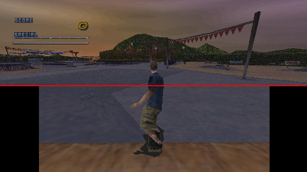

# Cumulative Patch for Tony Hawk's Pro Skater 2 PC
This cumulative patch allows you to run THPS2 at a modern widescreen resolution in 32 bits color depth without FPS limit.

## Installation
[__Download latest patch release here__](https://github.com/DCxDemo/THPS2-Cumulative-Patch/releases/latest) \
For thorough patch installation instructions please refer to the [__user guide__](https://github.com/DCxDemo/THPS2-Cumulative-Patch/wiki). \
For additional support join LegacyTHPS Discord: https://discord.gg/vTWucHS

## Key features
* unlocked FPS, 32 bits, any resolution up to 2048 (DirectDraw limit)
* increased fog distance, field of view
* XInput controllers support
* additional levels support (from [LevelPack](http://www.thps-mods.com/forum/viewtopic.php?t=1041))
* additional skater styles support
* unlimited custom soundtrack support, R3 skips track
* restored rail balance bar
* bonus: start+select on the controller quits the game instantly



## Building
The patch is being developed in Visual Studio 2022. \
There are 2 solutions:
* ```th2patch``` - patch DLL written in C++
* ```th2patchlauncher``` - launcher app written in C# (.NET Framework 4.6.2). \
Make sure $(ProjectDir) is added to Additional include directories. \
Make sure target binary is called dinput.dll, could be hawk2.dll by default \

Make sure to install launcher dependencies (via NuGet):
* ini-parser - https://github.com/rickyah/ini-parser

## Links
* [LegacyTHPS Discord](https://discord.gg/vTWucHS)
* [Video preview of the patch](https://www.youtube.com/watch?v=1eHHqhsgC6w)
* [Original thps-mods thread](http://www.thps-mods.com/forum/viewtopic.php?t=5429)
* [Installation and troubleshooting](https://github.com/DCxDemo/THPS2-Cumulative-Patch/wiki)

2016-2018, 2022-2023, DCxDemo*.